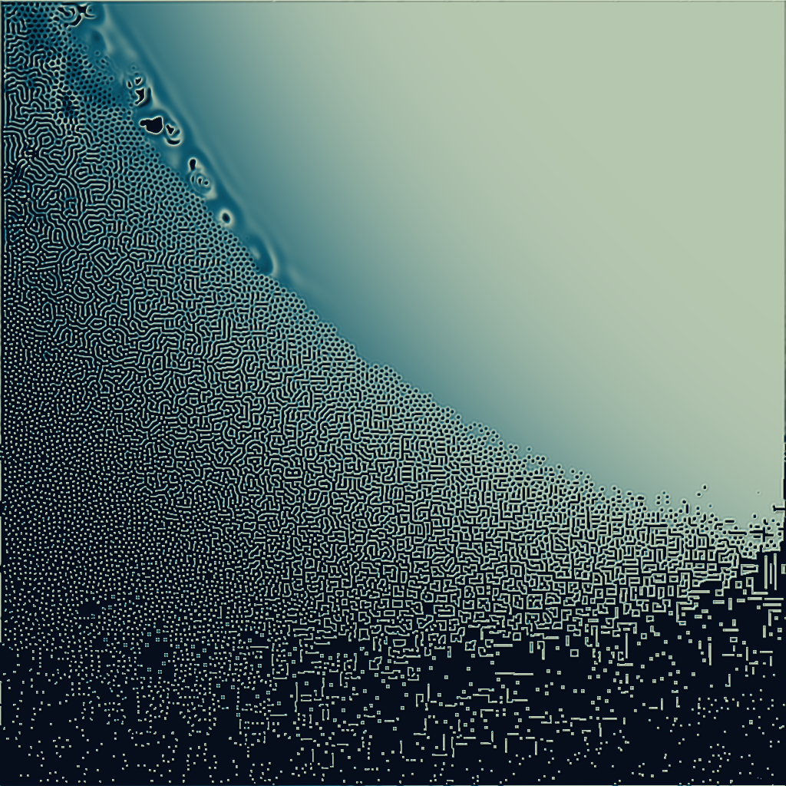

# wgpu-bun

[](https://www.npmjs.com/package/wgpu-bun)
[](https://github.com/argon-chat/wgpu/actions/workflows/ci.yml)
[](LICENSE)
[](https://bun.sh)

**The `webgpu` npm package segfaults Bun. This is a WebGPU that runs there.** A `bun:ffi` binding to
[wgpu-native](https://github.com/gfx-rs/wgpu-native) — the C API over
[`wgpu`](https://github.com/gfx-rs/wgpu), which is the core of WebGPU in **Firefox, Servo and
Deno** — API-compatible with [`webgpu`](https://www.npmjs.com/package/webgpu). Headless compute and
offscreen rendering on Windows, macOS and Linux, x64 and arm64.

```sh
bun add wgpu-bun
```

```ts
import { create, globals } from 'wgpu-bun';

Object.assign(globalThis, globals);            // GPUBufferUsage, GPUShaderStage, …

const gpu = create([]);
const adapter = await gpu.requestAdapter();
const device = await adapter!.requestDevice();

device.pushErrorScope('validation');
const module = device.createShaderModule({ code: '/* wgsl */' });
const error = await device.popErrorScope();    // ← reports. That is the whole point.
if (error) throw new Error(error.message);
```

The native library and the ABI shim arrive with it as an `optionalDependencies` platform package
matching your `os`/`cpu`. No install hook, no toolchain, no `cargo`.

## It renders


Not a mock-up: that is [`examples/sky.ts`](examples/sky.ts), a WGSL port of
[RedPewEngine](https://pew.red)'s Hillaire atmosphere, in four passes — two compute
kernels build the transmittance and multiple-scattering tables, a third ray-marches the sky into a
192×108 image, and a fullscreen shader adds an analytic sun disc and exposes the result.

```sh
bun run examples/sky.ts   # → sky.png
```

| | |
|:-:|:-:|
| [](examples/pathtracer.ts) | [](examples/lorenz.ts) |
| **pathtracer** — 4 096 spp × 8 bounces, 3.3 billion primary rays, one dispatch, 1.9 s | **lorenz** — 65 536 trajectories × 3 000 RK4 steps, 196 M `atomicAdd`s, no render pass |
| [](examples/mandelbrot.ts) | [](examples/reaction-diffusion.ts) |
| **mandelbrot** — 5 556× zoom, smoothed escape time, 4× supersampled | **reaction-diffusion** — 4 000 ping-ponged dispatches in one command buffer |

Plus [`triangle.ts`](examples/triangle.ts), which is the shortest thing that proves an install
works. The gallery, with what each one is actually demonstrating, is in
[examples/README.md](examples/README.md).

### Batteries: `wgpu-bun/image`

Getting pixels *out* is where headless work actually goes wrong, so it is in the box:

```ts
import { saveTexturePng, readTexture, encodePng } from 'wgpu-bun/image';

await saveTexturePng(device, target, 'frame.png');
```

`copyTextureToBuffer` demands a 256-byte-aligned row stride, so the buffer that comes back is
almost never the image — a 1400-pixel-wide frame arrives with 96 bytes of padding per row, and code
that ignores it renders a picture that shears progressively to one side. `readTexture` hands back
tightly packed rows and refuses a texture without `COPY_SRC` up front, because letting that reach
`wgpuQueueSubmit` aborts the process. `encodePng` has no dependencies.

It is a **subpath** on purpose: the root export stays exactly the three names `webgpu` exports, so
"what do I get if I swap the import" still has a one-sentence answer.

## Which one should you use

| | **wgpu-bun** | [`bun-webgpu`](https://github.com/kommander/bun-webgpu) | [`webgpu`](https://www.npmjs.com/package/webgpu) |
|---|---|---|---|
| Backend | **wgpu-native** — the Rust `wgpu` behind Firefox, Servo and Deno | Dawn — Chromium's | Dawn — Chromium's |
| Runs under Bun | **yes** | yes | **no** — the N-API addon segfaults the runtime |
| `popErrorScope()` | **reports, with negative tests proving it can go red** | crashes its allocator, even on an empty scope | works |
| `getCompilationInfo()` | **real diagnostics**, synthesised from the validation error | unimplemented | works |
| Surfaces / windowing | no — headless and offscreen only | no | no |

`bun-webgpu` covers the heavy end of the API competently and is a reasonable answer if Dawn is what
you want; that assessment, and why the backend is a choice worth making deliberately, is in
[docs/ERROR-PATH.md](docs/ERROR-PATH.md).

## Status

**Green on every supported platform, against three graphics APIs**, on wgpu-native `v29.0.1.1` — each
leg reaching a real device rather than skipping:

| platform | adapter | API |
|---|---|---|
| `win32-x64` | Microsoft Basic Render Driver (WARP), and a discrete NVIDIA adapter locally | D3D12 |
| `linux-x64` | llvmpipe (Mesa 25.2.8, 256-bit) | Vulkan |
| `linux-arm64` | llvmpipe (Mesa 25.2.8, 128-bit) | Vulkan |
| `darwin-arm64` | Apple Paravirtual device | Metal |

Three graphics backends, two processor architectures, two calling conventions. The CI legs that
cannot reach a device are configured to **fail rather than skip**, so a green matrix means the suite
ran, not that it was excused.

**Implemented:** adapter, device, buffers, textures, samplers, bind groups, pipelines, encoders,
queues; WGSL compilation, compute dispatch, render to texture, buffer readback, error scopes,
`getCompilationInfo()`, explicit backend selection.

**Refused, not stubbed.** Nothing returns a plausible-looking nothing. A call either does the thing
or throws saying it does not exist — including the 40 wgpu-native symbols that abort the process,
which are blocklisted by name. Out of scope: surfaces, render bundles, indirect draw, occlusion
queries, external textures ([why](docs/COMPATIBILITY.md#out-of-scope)).

Not done yet, and worth knowing before you depend on it: no WebGPU CTS run, and no discrete GPU
outside Windows — the full list is [docs/EVIDENCE.md](docs/EVIDENCE.md#remaining-gaps).

## Versioning: the major is the wgpu-native generation

`wgpu-bun@29.x.y` binds wgpu-native **v29**. That digit is not a maturity signal — it names the
native library inside, which is what decides ABI, validation strictness and WGSL acceptance. When
upstream moves to v30, so does this package's major, on the same day and for that reason alone. Minor
and patch are ordinary semver for this binding's own changes. A test asserts the major *is*
`WGPU_NATIVE_MAJOR`, so a pin bump cannot ship as `29.x` and tell everyone the ABI did not move.

**It ships v29 and accepts v27.** If your Rust half is on wgpu 27, point `WGPU_NATIVE_LIB` at that
library — or `bun run fetch --generation 27` — and the same suite that certifies v29 has been run
against it, on every platform, in CI. A generation nobody has tested is refused at load rather than
warned about, because the differences between generations produce wrong answers rather than errors.
[docs/GENERATIONS.md](docs/GENERATIONS.md) has the measurements.

## Migrating from `webgpu`

An import-specifier change and nothing else — the surface is the same three exports (`create`,
`globals`, `isMac`) over standard [`@webgpu/types`](https://www.npmjs.com/package/@webgpu/types).
Route it through a one-line local re-export module and swapping back is a single edit for a whole
codebase. The differences that do exist — the two Dawn-proprietary globals, `navigator.gpu`,
`copyExternalImageToTexture` — are enumerated in [docs/COMPATIBILITY.md](docs/COMPATIBILITY.md).

Confirming an install landed:

```ts
import { resolveNativeLibrary, STATUS } from 'wgpu-bun';

console.log(STATUS);
console.log(resolveNativeLibrary());
// { path: '…/vendor/win32-x64/lib/wgpu_native.dll', source: 'vendor',
//   includeDir: '…/vendor/win32-x64/include', version: 'v29.0.1.1' }
```

## Documentation

The engineering behind the claims above, kept out of the way rather than deleted:

- [**docs/ABI.md**](docs/ABI.md) — `bun:ffi` cannot pass a C struct by value, wgpu-native does it in
  both directions, and the two aggregate sizes partition the platforms *differently*. Also the 40
  symbols that abort the process, and the struct-layout oracle.
- [**docs/ERROR-PATH.md**](docs/ERROR-PATH.md) — why an error scope that cannot go red is worse than
  a crash, what shader diagnostics actually are here, and the prior-art assessment.
- [**docs/COMPATIBILITY.md**](docs/COMPATIBILITY.md) — the `webgpu` contract precisely, backend
  selection, how much of WebGPU real code touches, and what is out of scope.
- [**docs/GENERATIONS.md**](docs/GENERATIONS.md) — which wgpu-native generations this binding
  accepts, what was measured on each, and what adding one costs.
- [**docs/PACKAGING.md**](docs/PACKAGING.md) — per-platform packages, why there is no postinstall
  hook, versioning, pinning and provenance.
- [**docs/EVIDENCE.md**](docs/EVIDENCE.md) — what is proven by execution versus argued from a
  specification, the remaining gaps, and the rules that stop a skipped GPU suite reading as a pass.
- [**docs/RELEASE.md**](docs/RELEASE.md) — how a release is cut.

## Working on the package

```sh
bun install
bun run fetch          # download + verify the pinned wgpu-native for this host
bun run shim:build     # build the ABI shim (needs cargo; see docs/ABI.md)
bun run check:layouts  # confirm the generated struct layouts match those headers
bun run typecheck
bun test
```

`shim:build` is optional **only on `win32-x64`**, where the direct path is correct anyway — and even
there it is worth building, because it is the path that ships everywhere else. On `linux-x64`,
`linux-arm64` and `darwin-arm64` it is not optional: without it the GPU suites skip with
`abi-unsupported`.

## Licence

MIT © 2026 Argon Inc — see [LICENSE](LICENSE). That covers this repository's own code only.

[wgpu-native](https://github.com/gfx-rs/wgpu-native) is dual-licensed **MIT or Apache-2.0** by the
gfx-rs project. Its binaries are not vendored into this repository — they are fetched from upstream's
own releases — but the per-platform npm packages *do* redistribute them, so those packages declare
`MIT OR Apache-2.0` and carry [`LICENSE-WGPU-NATIVE`](LICENSE-WGPU-NATIVE)
([why](docs/PACKAGING.md#licence-redistribution)).

[`bun-webgpu`](https://github.com/kommander/bun-webgpu) (Apache-2.0) is credited as prior art; it is
not a dependency and no code is taken from it.
