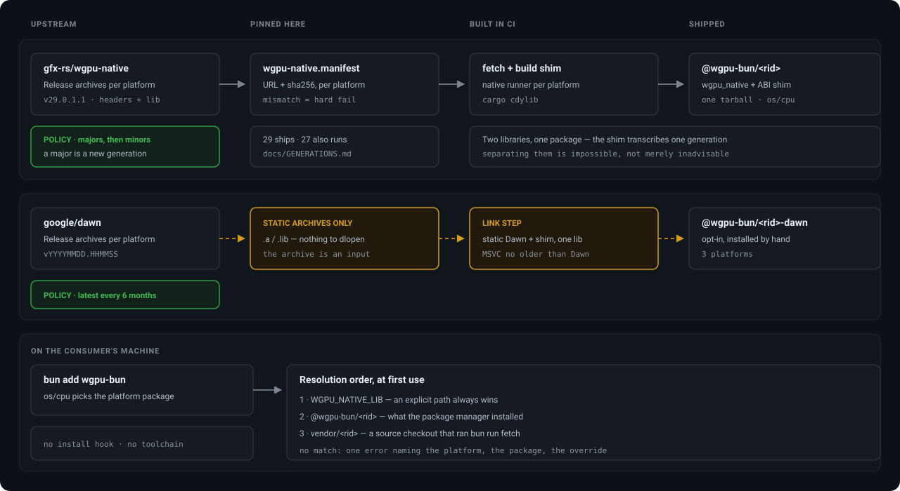

# Packaging, versioning and supply chain

How the native binaries reach you, why the version number says `29`, and what is pinned.



## Tracking upstream: two projects, two policies

**wgpu-native is tracked by version.** A new **major** is a different wgpu-core generation and this
package's major moves with it; a new **minor** over the same generation is an ordinary bump — a week
of work and an afternoon, which the watcher reports as two different events.

**Dawn is tracked by the calendar.** It tags every commit, roughly weekly, no semver and no LTS line,
so "is there something newer" answers *yes* forever. Policy: adopt whatever is current **every six
months**, measured from the last adoption.

Both are declared in [`upstream.manifest.ts`](../upstream.manifest.ts); the workflow only evaluates
them. ⚠ The schedule is a **daily** run (`cron: "10 6 * * *"`), not a cron per policy: rate-limit one
run of a twice-yearly cron and the next attempt is six months away, with nothing saying so. Asking
daily and answering by policy makes a missed run a one-day delay.

## How the native libraries reach you

Via **per-platform npm packages in `optionalDependencies`** — `@wgpu-bun/win32-x64`,
`@wgpu-bun/linux-x64`, and so on, each declaring `os` / `cpu` so your package manager installs
exactly the matching one, as esbuild, swc, sharp and `bun-webgpu` all do. Each carries **two**
libraries: upstream's `wgpu_native` and this project's ABI shim. One tarball rather than two
packages, because a shim transcribes one generation's struct layouts by hand and is only correct
paired with it — the binding checks for skew at load and refuses, but shipping them together makes
the skewed state unreachable. Neither is fetched at install time, and **no consumer needs a Rust
toolchain**: CI builds the shim, one platform per matching runner.

### Dawn: three more packages, and they are opt-in

`@wgpu-bun/<rid>-dawn` — `win32-x64`, `linux-x64`, `darwin-arm64` — each carrying **one** library,
because `dawn:link` fuses the ABI shim's objects into the Dawn library itself. A suffix on the same
scope rather than a scope of its own, so a missing install fails with a searchable name.
`linux-arm64` is absent because Google publishes no arm64 Linux desktop build.

**They are never wired into `optionalDependencies`.** An optional dependency installs by default, and
a consumer who never types `WGPU_BUN_IMPL=dawn` should not be downloading a second WebGPU
implementation of 10–20 MiB; `bun run release:wire --impl dawn` therefore refuses outright. They are
linked by [dawn-build](../.github/workflows/dawn-build.yml) — on every push touching `src/`, `test/`,
the shim or the Dawn scripts, called from the release rather than copied into it, each leg running
the whole suite against what it just linked. Preflight also refuses a Dawn package whose library does
not export the fused shim: it would install, load, and fail on the first by-value call, which no
directory listing can show since the package is one file either way.

Dawn's terms ship as `LICENSE-DAWN`, verbatim from the pinned commit, under the same rule as
wgpu-native's: neither project puts a licence file in its release archive, so this is the only copy
that reaches a consumer.

### Why not a postinstall hook

**`bun install` does not run lifecycle scripts of installed dependencies.** Only packages on Bun's
curated allowlist (`bun pm default-trusted`) run them; anything else needs *the consumer* to add this
package to `trustedDependencies` or run `bun pm trust`. Bun prints
`Blocked 1 postinstall. Run 'bun pm untrusted' for details.` and still reports overall success, so
the package is broken at runtime with a library-not-found error one easily-missed install line away
from its cause. For a package whose primary audience *is* Bun users, broken-by-default on Bun is not
shippable.

Sub-packages also survive `--ignore-scripts`, are integrity-checked by the registry, install from a
warm cache offline, and need no egress to GitHub releases from networks where only a mirrored npm
registry is reachable. The cost is publishing N+1 packages instead of 1. There is therefore **no
`postinstall` hook** in `package.json`, and there will not be one.

### The sharp edge

**`optionalDependencies` fail silently.** On a platform with no matching package your package manager
installs nothing and reports success; the first thing that notices is this package's own resolver, so
its error names the platform it looked for, the package that would have provided it, and the
`WGPU_NATIVE_LIB` override.

Resolution order is `WGPU_NATIVE_LIB` → `@wgpu-bun/<rid>` → `vendor/<rid>/`, so an explicitly built
library always wins and a development checkout works with no publishing at all. `bun run fetch`
populates `vendor/`, and is what the release staging step reads.

## Versioning

**The major version is the wgpu-native generation this package binds.**

```
wgpu-bun@29.0.0
         ││ └── patch — this binding's own changes
         │└──── minor — this binding's own changes
         └───── major — wgpu-native v29. Not ours to pick.
```

A bump from `29.x` to `30.x` means the native library changed generation — expect different
validation, possibly different WGSL acceptance — and it happens even if not one line of this binding
changed. **Shipping one generation is not the same as accepting one:** the major names what the
platform packages carry, while the binding loads any generation in `SUPPORTED_GENERATIONS` and
refuses the rest at load. See [GENERATIONS.md](./GENERATIONS.md).

**Why not mirror the upstream tag exactly.** wgpu-native tags have four components (`v29.0.1.1`:
wgpu-core `29.0.1`, then upstream's own revision) and semver has three, so the exact tag lives where
it can be read in full — [`wgpu-native.manifest.ts`](../wgpu-native.manifest.ts), the README, and the
`.version` stamp beside the installed library. `test/generations.test.ts` asserts this package's
major **is** `WGPU_NATIVE_MAJOR`, so a pin bump to v30 cannot ship as `29.x`.

**Why not track the [`webgpu`](https://www.npmjs.com/package/webgpu) package's version**, given this
is API-compatible with it: that number moves for Dawn updates and its own fixes, and says nothing
about which native library is inside.

## Supply chain

Native binaries are **fetched, never committed**, each pinned to an exact URL and an exact sha256 —
[`wgpu-native.manifest.ts`](../wgpu-native.manifest.ts) for upstream's archives,
[`shim.manifest.ts`](../shim.manifest.ts) for the ABI shim. A mismatch always hard-fails, including
under `--soft`, which exists so a fresh clone without network can proceed, not to wave through an
unexpected binary. Every shim `sha256` is empty because no shim release has been cut; an empty hash
means unpinned, and `bun run shim:fetch` refuses to install one rather than invent a plausible hash.
That refusal is maintainer-path only — consumers get the shim from the platform npm package.

```sh
bun run fetch                      # this host
bun run fetch --rid linux-arm64    # cross-fetch another platform
bun run fetch --force              # re-download even if the version stamp matches
bun run fetch:hashes               # re-measure every pinned archive's sha256, print, write nothing
```

Archive layout is **probed, not hardcoded**: the script searches the extracted tree for
`wgpu_native.{dll,so,dylib}` and the `webgpu.h` / `wgpu.h` headers by name, so an upstream reshuffle
surfaces as "not found in archive" rather than a silently-empty directory. Bumping the pin edits one
generation's entry in `wgpu-native.manifest.ts` — its `tag` and the four asset URLs; `WGPU_NATIVE_TAG`
derives from it and is not edited. Then `bun run fetch:hashes` to re-measure and `bun run gen:layouts`
to regenerate the struct tables. Hashes are pasted by a human, never written by the tool.

### Provenance, and what it does not cover

Releases are published from CI with [npm trusted publishing](https://docs.npmjs.com/trusted-publishers/):
OIDC-issued, short-lived, workflow-specific credentials, no long-lived `NPM_TOKEN` anywhere. npm
attaches provenance automatically — `wgpu-bun@29.0.0` and all four platform packages carry a SLSA v1
attestation on the registry.

**That attestation covers *this* build**: it binds a commit in this repository to the bytes published
under this name. It says **nothing** about the origin of the bundled `wgpu_native` library, which the
pinned URL and sha256 in `wgpu-native.manifest.ts` cover separately — verifiable against upstream's
own release page.

### Licence redistribution

**Upstream's release archives contain no licence text at all** — the pinned Windows archive holds
exactly `include/`, `lib/` and `wgpu-native-meta/`. Shipping the shared library without accompanying
terms would be a licence violation, so [`LICENSE-WGPU-NATIVE`](../LICENSE-WGPU-NATIVE) is committed
here verbatim from the wgpu-native repository at the pinned tag and copied into every platform
package, which declare `MIT OR Apache-2.0` accordingly. It is not generated: a synthesised licence
would mean an invented copyright line. `bun run release:check` refuses to stage a release without it.
